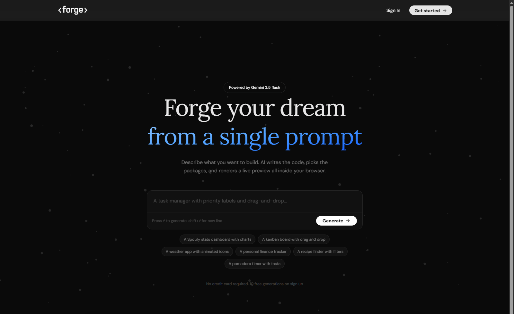
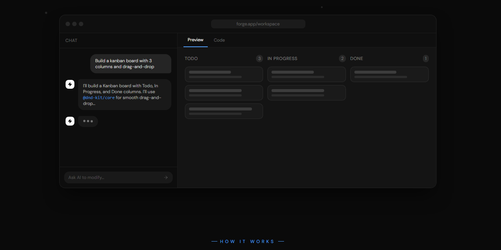

# ForgeAI

[Live Demo](https://www.forgeai.lol) | [Repository](https://github.com/sahiljadhav7/ForgeAI)



AI app builder that turns natural-language prompts into working React apps inside a live browser workspace. Users can generate an app, inspect the code, preview it instantly with Sandpack, iterate through chat, upload a reference image, and export the result as a ZIP.

This project was an attempt to build the layer around AI code generation that most demos skip: persistent workspaces, streaming UX, plan and credit controls, safe retries, and a preview environment that feels immediate instead of fragile.

## What It Does

- Generates React apps from plain-English prompts
- Streams generation progress back to the UI in real time
- Persists workspaces, messages, and generated files in PostgreSQL
- Renders the generated app live in the browser with Sandpack
- Supports image-guided generation through Supabase Storage uploads
- Includes a Pro-only improvement agent for editing existing generated apps
- Exports generated projects as downloadable ZIP files

## Workspace



The landing page includes a product mockup of the core workflow: prompt on the left, streamed assistant response in chat, and a live preview/code surface on the right.

---

## Demo

## Demo

[Watch the demo video](./public/project1ForgeAi.mp4)

## Why I Built It

Most AI app-generation demos stop at a single model call and a blob of code. I wanted to build something closer to a usable product:

- a stateful workspace instead of a one-off response
- a live preview loop instead of copy-pasting code elsewhere
- retries and model fallbacks instead of brittle happy-path generation
- gated premium workflows to reflect real product constraints
- abuse protection around the most expensive endpoints

## Interesting Engineering Problems

### Streaming generation without a janky UI

The generation route streams progress to the client over server-sent events. That lets the chat panel show incremental status updates while the model is still working, which makes the app feel much more responsive than a single blocking spinner.

### Updating Sandpack without remounting the preview

One of the trickier parts was keeping the live preview stable while code changed. The app keys the Sandpack provider only on the file path set, then pushes file content changes with `sandpack.updateFile()`. That avoids unnecessary remounts and makes iteration smoother.

### Separating generation from improvement

Initial generation and improvement are handled by different routes on purpose. The generation flow is optimized for returning a full project snapshot, while the improvement flow behaves more like an agent that reasons about which files to rewrite. Keeping those paths separate made plan-gating, prompts, and failure handling cleaner.

### Making model output safe to use

The Gemini generation route expects strict JSON, parses it defensively, validates dependencies against the npm registry, and only then persists the workspace. That extra validation step matters when the output is being fed directly into a live preview environment.

### Protecting expensive AI routes

Arcjet is used in two places: middleware protection and endpoint-level protection. The generation route applies rate limiting, prompt injection checks, and sensitive-info detection before doing the expensive work.

## Tech Stack

| Area         | Choices                                               |
| ------------ | ----------------------------------------------------- |
| Frontend     | Next.js 16, React 19, TypeScript, Tailwind CSS 4      |
| UI           | shadcn/ui, Base UI, Lucide, Sonner, React Markdown    |
| Live Preview | Sandpack                                              |
| Backend      | Next.js App Router, Route Handlers, Server Components |
| Database     | Prisma 7, PostgreSQL, Prisma PG adapter               |
| Auth         | Clerk                                                 |
| AI           | Google Gemini, Cline SDK                              |
| Storage      | Supabase Storage                                      |
| Security     | Arcjet                                                |
| Export       | JSZip                                                 |

## Architecture

### Main flow

1. A user signs in with Clerk.
2. A local user record is created or updated in PostgreSQL.
3. The user submits a prompt in the workspace.
4. `/api/gen-ai-code` sends the conversation and file context to Gemini.
5. The server streams status updates back to the client.
6. The returned JSON is validated and persisted as workspace state.
7. Sandpack renders the generated files as a live preview.
8. The user can keep iterating in chat or use the Pro improvement agent.
9. The generated app can be exported as a ZIP.

### Core pieces

- `app/api/gen-ai-code/route.ts`
  Streams generation, validates model output, saves workspace data, and decrements credits.
- `app/api/improve/route.ts`
  Runs the Pro improvement flow with the Cline SDK and tool-driven file rewrites.
- `components/WorkspaceClient.tsx`
  Coordinates generation, improvement, streaming state, and workspace persistence in the UI.
- `components/ChatPanel.tsx`
  Handles prompts, uploaded reference images, credits display, and assistant messages.
- `components/CodePanel.tsx`
  Hosts Sandpack preview, code explorer, export, and the improvement UI.
- `lib/checkUser.ts`
  Syncs Clerk users into the local Prisma user table and handles plan updates.
- `lib/arcjet.ts`
  Centralizes endpoint protection rules.

## Product Decisions

- Workspaces store `messages` and `fileData` as JSON so the schema can stay simple while the generated project structure remains flexible.
- The app charges one credit per generation or improvement, which keeps the usage model easy to reason about.
- The improvement workflow is Pro-only because it is more agentic, more expensive, and materially different from one-shot generation.
- Image uploads go through Supabase Storage so prompts can include real visual references without bloating the database.

## What I Learned

- Good AI UX is as much about state management and recovery paths as it is about the model itself.
- Streaming status updates dramatically improve perceived performance, even when total latency stays the same.
- Separating "generate" from "improve" reduced complexity in both prompting and product logic.
- Sandpack can feel surprisingly solid for this kind of workflow if file updates are handled carefully.

## What I Would Improve Next

- Add proper payments and subscription syncing for Starter and Pro plans
- Add version history so users can compare generated iterations
- Improve observability around model failures and retry paths
- Add project templates and starter prompts
- Deploy exported apps directly from the workspace

## Local Setup

### Prerequisites

- Node.js 20+
- npm
- PostgreSQL
- Clerk project
- Google Gemini API key
- Arcjet key
- Supabase project with a `workspace-images` bucket

### Run locally

```bash
npm run prisma:generate
npm run prisma:db:push
npm run dev
```

## Project Structure

```text
app/          App Router pages, layouts, and API routes
actions/      Server-side data access helpers
components/   Workspace UI and reusable components
lib/          Prisma, Arcjet, constants, and shared helpers
prisma/       Schema and migrations
public/       Static assets
types/        Shared TypeScript types
```

---

Designed & built by Sahil Jadhav · 2026
